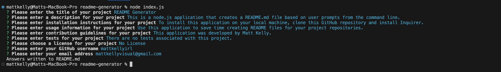

# README Generator

## Description
This Node.js application is a command line tool that creates a README.md file based on user prompts. It was designed as a faster alternative to creating README files for software repositories. 

## Table of Contents
- [Description](#description)
- [Installation](#installation)
- [Usage](#usage)
- [Contribution](#contribution)
- [Tests](#tests)
- [License](#license)
- [Questions](#questions)

## Installation Instructions
To install this application, clone this repository to your local machine and download the Inquirer package by executing "npm install inquirer@8.2.4". Please note, Node.js must be installed on your local machine for this application to run. 

## Usage
To use this application, execute "node index.js" to start the application. Answer out the prompts as requested, to create your own personalised README.md file. Once you have successfully answered all prompts, a README.md file will be created inside your local working directory. 

## Contribution Guidelines
This project was developed by Matt Kelly.

## Tests
There are no tests associated with this project.

## License

This project not licensed. For more information regarding licences, please visit this link: https://opensource.org/license/

## Questions
Please feel free to contact me via my GitHub or Email address below for any questions associated with this application:  
GitHub: [mattkellyirl](https://github.com/mattkellyirl)  
Email: mattkellyvisual@gmail.com